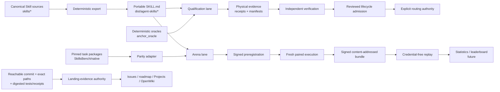

# agent-skills-repo

Evidence-first governance, physical qualification, and comparative evaluation for portable Agent Skills.

> **繁體中文摘要**
>
> 這個 repository 不是單純收集 prompts 或 `SKILL.md` 的 catalog。它是 Agent Skill 的獨立 authority plane：管理 canonical Skill source、可攜式 `SKILL.md` export、deterministic verification、sandbox execution evidence、signed receipts、independent verification、lifecycle admission，以及 baseline/candidate 的 paired Arena experiment。
>
> 目前沒有任何 Skill 被標記為 `production_routable: true`，也尚未發布 public leaderboard。格式通過、local tests、signed result、verified result、human admission、production routing 與 Arena ranking 都是不同狀態，不可互相代替。

## Contents

- [Repository purpose](#repository-purpose)
- [Authority and product boundaries](#authority-and-product-boundaries)
- [Current truth](#current-truth)
- [Architecture and state machines](#architecture-and-state-machines)
- [Usage Entry](#usage-entry)
- [Common workflows](#common-workflows)
- [Repository layout](#repository-layout)
- [Complete index](#complete-index)
- [Contribution and evidence rules](#contribution-and-evidence-rules)
- [Roadmap](#roadmap)
- [License](#license)

## Repository purpose

The repository addresses four recurring failures in Agent Skill systems:

1. A skill can be syntactically valid but behaviorally ineffective.
2. A one-shot demo can look successful while hiding retries, failed runs, contamination, or environment drift.
3. A signed result can still lack independent verification or lifecycle admission.
4. GitHub Issues, PR prose, and dashboards can drift away from what actually reached `main`.

It therefore owns five linked planes:

| Plane | Responsibility | Main entrypoints |
|---|---|---|
| **Artifact governance** | Canonical sources, portable Agent Skills exports, resource integrity, lifecycle metadata | [`skills/`](skills/), [`skill_arena/agent_skills_export.py`](skill_arena/agent_skills_export.py), [`dist/agent-skills/registry.json`](dist/agent-skills/registry.json) |
| **Qualification** | Deterministic oracles, sandbox contracts, signed receipts, hard gates, verification, admission | [`anchor_oracle/`](anchor_oracle/), [`skill_arena/core.py`](skill_arena/core.py), [`skill_arena/sandbox_executor/`](skill_arena/sandbox_executor/) |
| **Comparative Arena** | Pinned tasks, no-skill baseline, randomized paired runs, complete denominators, signed bundles, replay | [`arena_adapters/skillsbench/`](arena_adapters/skillsbench/), [`skill_arena/experiment/`](skill_arena/experiment/) |
| **Delivery truth** | Bind completion to reachable Git history, exact changed paths, and digested test or receipt evidence | [`data/project/landing-evidence.json`](data/project/landing-evidence.json), [`data/project/landing-evidence.d/`](data/project/landing-evidence.d/) |
| **Documentation projection** | Human and agent navigation, architecture, lifecycle, and generated graph views | [`openwiki/index.md`](openwiki/index.md), [`openwiki/quickstart.md`](openwiki/quickstart.md), [`data/wiki_graph/`](data/wiki_graph/) |

This repository is also the target repository used by the source-anchoring documentation experiment. That separate role is explained in [`README-EXPERIMENT.md`](README-EXPERIMENT.md).

## Authority and product boundaries

The central rule is that evidence states remain separate:

```text
portable format conformance
  != source anchoring

source anchoring
  != local correctness

local correctness
  != physical sandbox qualification

signed result
  != independently verified result

verified result
  != lifecycle admission

lifecycle admission
  != production or implicit routing

Arena comparison
  != qualification
```

The repository does **not** currently claim to be:

- a production-hosted multi-tenant execution service;
- a marketplace or payment system;
- a production trust-root provider;
- a catalog of qualified or production-routable skills;
- a universal single-score leaderboard;
- an authority allowed to turn Arena rank into qualification automatically.

Read [`INTEGRATION_REQUIREMENTS.md`](INTEGRATION_REQUIREMENTS.md) for the canonical qualification and Atlas handoff contract, then [`AGENTS.md`](AGENTS.md) or [`CLAUDE.md`](CLAUDE.md) before modifying a load-bearing plane.

## Current truth

The table below is a human summary. Machine authority remains the merged view of [`data/project/landing-evidence.json`](data/project/landing-evidence.json) and [`data/project/landing-evidence.d/`](data/project/landing-evidence.d/), validated against Git history.

| Area | Current state on `main` | What is still missing |
|---|---|---|
| Portable Agent Skills | Three deterministic exports exist and pass the pinned upstream `skills-ref` contract | All three remain non-routable |
| Source anchoring | Native lexical path-and-quote oracle, hardened tests, repo-wiki corpus guards | Lexical validity is not semantic truth |
| SkillsBench adapter | Three pinned task bundles have source/normalized executable parity evidence | Broader task-family coverage |
| Qualification hard gates | Signed receipts, economics, lifecycle contracts, and replicated stochastic-case policy exist | Fresh physical qualification and human admission |
| OpenShell executor | Fail-closed OpenShell 0.0.59 contract, signing, offline pair verification, and key-history audit exist | Two repository-local gateway-backed physical runs and landed cleanup evidence; see [#3](https://github.com/ed3c/agent-skills-repo/issues/3) and [#30](https://github.com/ed3c/agent-skills-repo/issues/30) |
| Arena control plane | Signed preregistration, randomized paired identity, fresh workspaces, one attempt per invocation, complete denominator, content-addressed bundles, and offline replay exist | A completed replacement-provider physical matrix with landed raw evidence; see [#15](https://github.com/ed3c/agent-skills-repo/issues/15) and [#46](https://github.com/ed3c/agent-skills-repo/issues/46) |
| Provider policy | Retired-provider fail-closed authority and local provider preflight contracts exist | Reviewed live provider/budget authority and successful physical execution |
| Quote-repair study | An execution-disabled signed preregistration binds the current diagnostic study | Physical efficacy matrix and independent replay; see [#53](https://github.com/ed3c/agent-skills-repo/issues/53) |
| Public leaderboard | Not published | Sealed pools, statistics, trust gates, JSON/Parquet publication, and review UI |

### Current portable registry

| Canonical source | Portable export | Lifecycle | Production routable |
|---|---|---:|---:|
| [`skills/autoresearch_composer/`](skills/autoresearch_composer/) | [`dist/agent-skills/autoresearch-composer/`](dist/agent-skills/autoresearch-composer/) | `production-seed-candidate` | `false` |
| [`skills/gemini_interactions/`](skills/gemini_interactions/) | [`dist/agent-skills/gemini-interactions/`](dist/agent-skills/gemini-interactions/) | `quarantined` | `false` |
| [`skills/repo_wiki_verified/`](skills/repo_wiki_verified/) | [`dist/agent-skills/repo-wiki-verified/`](dist/agent-skills/repo-wiki-verified/) | `pending-qualification` | `false` |

The authoritative export inventory and digests are in [`dist/agent-skills/registry.json`](dist/agent-skills/registry.json).

## Architecture and state machines



### Qualification state machine

```text
canonical source
  -> deterministic portable export
  -> candidate artifact
  -> physical sandbox result
  -> signed result
  -> independent verification
  -> reviewed lifecycle admission
  -> explicit production-routing permission

Any mandatory failure:
  -> rejected / non-eligible / quarantined / retired
```

Passing an earlier state never grants a later state.

### Arena state machine

```text
pinned task source
  -> normalized content-addressed bundle
  -> executable parity
  -> signed preregistration
  -> randomized baseline/candidate invocations
  -> complete signed run bundle
  -> offline replay
  -> paired statistics and eligibility
  -> immutable leaderboard snapshot
```

The final statistics and leaderboard stages remain roadmap work.

## Usage Entry

### Prerequisites

- Python 3.11 or newer;
- Git;
- Docker only for Docker-backed SkillsBench, BenchFlow, or physical sandbox work;
- Bun only for the separate repo-local terminal operator under [`.agents/skills/repo-terminal-operator/`](.agents/skills/repo-terminal-operator/);
- an externally provisioned provider credential or local inference endpoint only when executing a reviewed physical Arena profile;
- an external development Ed25519 private key only when producing sandbox evidence.

Never place provider credentials or signing private keys in the checkout, fixtures, logs, Issues, PR text, or uploaded artifacts.

### Clone and install

```sh
git clone https://github.com/ed3c/agent-skills-repo.git
cd agent-skills-repo

python3 -m venv .venv
. .venv/bin/activate
python3 -m pip install --upgrade pip
python3 -m pip install -r requirements.lock
python3 -m pip install pytest==8.4.1

git config core.hooksPath .githooks
```

### Baseline repository validation

```sh
python3 scripts/git_gate.py
python3 scripts/check_openwiki.py
python3 scripts/check_plan_package_compat.py
python3 scripts/check_wiki_graph_sync.py
python3 scripts/export_agent_skills.py --check
python3 scripts/check_skill_arena_roadmap.py

git fetch origin main
python3 scripts/check_landing_evidence.py --main-ref origin/main
```

`scripts/git_gate.py` preserves a historical ordered-gate contract. The export, roadmap, full-history landing-evidence, experiment, and physical-evidence workflows remain separate because they have different authorities and evidence requirements.

### Focused self-tests

```sh
# Portable Agent Skills
python3 -m pytest -q tests/test_agent_skills_export.py
python3 scripts/export_agent_skills.py --check

# Source anchoring and repo-wiki corpus
python3 scripts/anchor_oracle.py --selftest
python3 -m pytest -q \
  tests/test_anchor_oracle.py \
  tests/test_repo_wiki_verified_corpus.py

# SkillsBench task identity and executable parity contracts
python3 -m pytest -q \
  tests/test_skillsbench_adapter.py \
  tests/test_skillsbench_execution.py \
  tests/test_skillsbench_execution_benchflow_shape.py \
  tests/test_skillsbench_execution_image_binding.py \
  tests/test_skillsbench_execution_policy.py

# Arena plan, provider policy, replay, and preregistration
python3 scripts/arena_experiment.py selftest
python3 -m pytest -q \
  tests/test_arena_experiment.py \
  tests/test_arena_experiment_benchflow_adapter.py \
  tests/test_arena_provider_policy.py \
  tests/test_quote_repair_preregistration.py

# Sandbox contract, paired evidence, and key audit
python3 -m pytest -q \
  tests/test_sandbox_executor.py \
  tests/test_openshell_evidence_pair.py \
  tests/test_development_private_key_audit.py \
  tests/test_openshell_physical_evidence_workflow.py
```

Contract tests prove the code contract only. They do not prove that a physical sandbox, provider, cleanup path, signed receipt, verification, admission, or production route has run.

## Common workflows

### 1. Add or update a Skill

1. Edit the canonical source under `skills/<source_id>/`.
2. Update source lifecycle, corpus, references, and behavior assets together.
3. Regenerate portable artifacts intentionally.
4. Verify that exports are byte-current and lifecycle-neutral.
5. Run focused tests and the repository gates.

```sh
python3 scripts/export_agent_skills.py --write
python3 scripts/export_agent_skills.py --check
python3 -m pytest -q \
  tests/test_agent_skills_export.py \
  tests/test_skill_asset_governance.py
git diff -- skills dist/agent-skills
```

Do not edit `dist/agent-skills/` as the canonical source. Format conformance must never promote lifecycle or routing state.

### 2. Verify a source-anchored repository wiki

```sh
python3 scripts/anchor_oracle.py --help
python3 scripts/anchor_oracle.py --selftest
python3 -m pytest -q tests/test_anchor_oracle.py
```

The oracle verifies path resolution, file existence, and verbatim quote occurrence against pinned bytes. It does not prove that a quote semantically supports a claim. See [`openwiki/anchor-oracle-comparison.md`](openwiki/anchor-oracle-comparison.md).

### 3. Import pinned SkillsBench tasks

The upstream repository and commit are declared in [`data/skillsbench/import-policy.json`](data/skillsbench/import-policy.json).

```sh
python3 scripts/import_skillsbench_tasks.py import \
  --upstream-root /path/to/pinned-skillsbench-checkout \
  --output-root /tmp/arena-task-bundles

python3 scripts/import_skillsbench_tasks.py validate-all \
  --output-root /tmp/arena-task-bundles
```

Only parity-passed source/normalized bundles may influence Arena work. See [`docs/skillsbench-adapter.md`](docs/skillsbench-adapter.md).

### 4. Preregister or replay an Arena experiment

```sh
python3 scripts/arena_experiment.py --help
python3 scripts/arena_experiment.py selftest

python3 scripts/preflight_arena_provider.py --help
python3 scripts/check_arena_provider_preflight.py --help
python3 scripts/run_arena_benchflow_experiment.py --help

python3 scripts/preregister_quote_repair.py --help
python3 scripts/check_quote_repair_preregistration.py --help
```

A physical run requires a reviewed, versioned provider policy, declared credential source, approved budget, pinned task/skill/model/harness/image/policy identities, and complete failure retention. A successful single-task matrix remains a positive control, not a leaderboard claim.

### 5. Exercise the sandbox executor contract

```sh
python3 scripts/run_sandbox_case.py --help
python3 scripts/verify_openshell_evidence_pair.py --help
python3 scripts/audit_development_private_key.py --help
```

The committed OpenShell code is a fail-closed contract. Qualification requires real gateway-backed execution, fresh-workspace reproduction, cleanup and backing-container absence, receipt admission, tamper rejection, external public-key verification, and repository-local evidence landing. See [`docs/sandbox-executor.md`](docs/sandbox-executor.md) and [`docs/openshell-physical-evidence.md`](docs/openshell-physical-evidence.md).

### 6. Validate or update OpenWiki projections

```sh
python3 scripts/check_openwiki.py
python3 scripts/check_wiki_graph_sync.py
python3 scripts/sync_wiki_to_graph.py --help
```

Markdown remains the human documentation source, the event log is the audit trail, and graph JSON is the default projection. Start at [`openwiki/quickstart.md`](openwiki/quickstart.md) or the exhaustive wiki index at [`openwiki/index.md`](openwiki/index.md).

### 7. Validate delivery state

```sh
git fetch origin main
python3 scripts/check_landing_evidence.py --main-ref origin/main
```

A completed work item must bind a full commit reachable from `main`, exact first-parent changed paths, a changed-path digest, and digested test or receipt evidence. Add or update a fragment under [`data/project/landing-evidence.d/`](data/project/landing-evidence.d/) only after the referenced delivery is reachable.

### 8. Use the repo-local terminal operator

The terminal operator is a separate repository harness, not a production-routable catalog skill.

```sh
bun run .agents/skills/repo-terminal-operator/repo-adapter.ts --describe
```

It accepts typed, hash-bound leased slices and emits bounded code-quality and production-use evidence. Read [`.agents/skills/repo-terminal-operator/SKILL.md`](.agents/skills/repo-terminal-operator/SKILL.md) before use.

## Repository layout

```text
agent-skills-repo/
├── skills/                         # Canonical repository-native Skill sources
├── dist/agent-skills/              # Deterministic portable SKILL.md projections
├── skill_arena/                    # Qualification, evidence, lifecycle, Arena core
│   ├── experiment/                 # Signed paired experiment and provider contracts
│   └── sandbox_executor/           # OpenShell contract, signing, pair verification
├── arena_adapters/skillsbench/     # Pinned task import, normalization, parity
├── anchor_oracle/                  # Deterministic lexical source-anchor oracle
├── contracts/                      # Versioned JSON Schemas
├── data/                           # Policies, task/corpus identity, evidence, lifecycle
├── scripts/                        # CLI entrypoints and deterministic checks
├── tests/                          # Contract, negative-control, and replay tests
├── docs/                           # Hand-authored focused design and operations docs
├── openwiki/                       # Human/agent wiki and graph-projection source
├── .github/workflows/              # CI, parity, evidence, and physical-run workflows
├── .agents/skills/repo-terminal-operator/
│                                    # Typed repository operation harness
├── artifacts/                      # Operator-oriented retained artifacts
├── AGENTS.md                       # Agent repository contract
├── INTEGRATION_REQUIREMENTS.md      # Canonical qualification/Atlas handoff contract
├── PROJECT-SSOT.md                 # Repository role and source-of-truth declaration
└── README-EXPERIMENT.md            # Role in the OpenWiki anchoring experiment
```

## Complete index

This index covers every supported authority document, public package, schema, workflow, CLI, and top-level test on `main`. High-volume fixtures, generated pages, and operator internals are indexed at their owning directory rather than flattened into an unreadable file dump.

### Authority and operating documents

| Path | Purpose |
|---|---|
| [`INTEGRATION_REQUIREMENTS.md`](INTEGRATION_REQUIREMENTS.md) | Canonical qualification, physical evidence, signing, verification, admission, and Atlas round-trip contract |
| [`AGENTS.md`](AGENTS.md) | Mandatory agent behavior and review rules |
| [`CLAUDE.md`](CLAUDE.md) | Claude-oriented repository contract |
| [`PROJECT-SSOT.md`](PROJECT-SSOT.md) | Repository archetype, ownership, and source-of-truth rules |
| [`README-EXPERIMENT.md`](README-EXPERIMENT.md) | Relationship to `openwiki-source-anchoring` |
| [`plan-package.compat.yaml`](plan-package.compat.yaml) | Plan-package compatibility declaration |
| [`.plan-package.lock.yaml`](.plan-package.lock.yaml) | Pinned compatibility lock |
| [`pyproject.toml`](pyproject.toml) | Python package and pytest configuration |
| [`requirements.lock`](requirements.lock) | Pinned runtime dependencies |
| [`LICENSE`](LICENSE) | Repository license |

### Core Python packages

#### Qualification, governance, and delivery

- [`skill_arena/core.py`](skill_arena/core.py) — schemas, signatures, receipt admission, gates, qualification, lifecycle, and registry snapshots.
- [`skill_arena/skill_assets.py`](skill_arena/skill_assets.py) — artifact, corpus, digest, public/blind-pool, and conflict guards.
- [`skill_arena/agent_skills_export.py`](skill_arena/agent_skills_export.py) — canonical portable Agent Skills exporter.
- [`skill_arena/replicated_gates.py`](skill_arena/replicated_gates.py) — repeated-draw hard-gate policy for stochastic cases.
- [`skill_arena/calibration_provenance.py`](skill_arena/calibration_provenance.py) — historical calibration recovery and quarantine.
- [`skill_arena/landing_evidence.py`](skill_arena/landing_evidence.py) — Git reachability and exact changed-path authority.
- [`skill_arena/landing_evidence_fragments.py`](skill_arena/landing_evidence_fragments.py) — deterministic delivery-authority projections.
- [`skill_arena/roadmap.py`](skill_arena/roadmap.py) — machine-readable dependency roadmap validation.

#### Arena experiment package

- [`skill_arena/experiment/model.py`](skill_arena/experiment/model.py) — experiment identities, outcome taxonomy, metrics, and adapter types.
- [`skill_arena/experiment/plan.py`](skill_arena/experiment/plan.py) — deterministic paired matrix, randomization, and signed preregistration.
- [`skill_arena/experiment/runner.py`](skill_arena/experiment/runner.py) — one-attempt execution, fresh workspaces, evidence materialization, and bundle signing.
- [`skill_arena/experiment/replay.py`](skill_arena/experiment/replay.py) — credential-free offline replay and tamper checks.
- [`skill_arena/experiment/benchflow_adapter.py`](skill_arena/experiment/benchflow_adapter.py) — pinned BenchFlow result/evidence adapter.
- [`skill_arena/experiment/provider_policy.py`](skill_arena/experiment/provider_policy.py) — versioned provider capability, observation, revocation, and preflight policy.
- [`skill_arena/experiment/quote_repair.py`](skill_arena/experiment/quote_repair.py) — quote-repair task and signed study bindings.
- [`skill_arena/experiment/__init__.py`](skill_arena/experiment/__init__.py) — public experiment API.

#### Sandbox executor package

- [`skill_arena/sandbox_executor/model.py`](skill_arena/sandbox_executor/model.py) — sandbox profile, case, result, and evidence models.
- [`skill_arena/sandbox_executor/openshell059.py`](skill_arena/sandbox_executor/openshell059.py) — concrete OpenShell 0.0.59 CLI adapter.
- [`skill_arena/sandbox_executor/signing.py`](skill_arena/sandbox_executor/signing.py) — domain-separated signing and atomic evidence publication.
- [`skill_arena/sandbox_executor/evidence_pair.py`](skill_arena/sandbox_executor/evidence_pair.py) — two-run physical evidence admission.
- [`skill_arena/sandbox_executor/key_audit.py`](skill_arena/sandbox_executor/key_audit.py) — all-object development private-key absence audit.
- [`skill_arena/sandbox_executor/errors.py`](skill_arena/sandbox_executor/errors.py) — typed fail-closed errors.
- [`skill_arena/sandbox_executor/__init__.py`](skill_arena/sandbox_executor/__init__.py) — public sandbox API.

#### SkillsBench adapter

- [`arena_adapters/skillsbench/task.py`](arena_adapters/skillsbench/task.py) — native `task.md` parsing.
- [`arena_adapters/skillsbench/policy.py`](arena_adapters/skillsbench/policy.py) — pinned upstream import policy.
- [`arena_adapters/skillsbench/normalizer.py`](arena_adapters/skillsbench/normalizer.py) — content-addressed normalization and index generation.
- [`arena_adapters/skillsbench/execution.py`](arena_adapters/skillsbench/execution.py) — executable source/normalized evidence.
- [`arena_adapters/skillsbench/execution_image.py`](arena_adapters/skillsbench/execution_image.py) — immutable environment image binding.
- [`arena_adapters/skillsbench/parity.py`](arena_adapters/skillsbench/parity.py) — executable parity binding and ranking eligibility.
- [`arena_adapters/skillsbench/models.py`](arena_adapters/skillsbench/models.py) — adapter data types.
- [`arena_adapters/skillsbench/common.py`](arena_adapters/skillsbench/common.py) — canonical JSON, digest, and path helpers.
- [`arena_adapters/skillsbench/__init__.py`](arena_adapters/skillsbench/__init__.py) — public adapter API.

#### Deterministic anchor oracle

- [`anchor_oracle/core.py`](anchor_oracle/core.py) — OKF/frontmatter, path resolution, quote occurrence, and verdict logic.
- [`anchor_oracle/__init__.py`](anchor_oracle/__init__.py) — public oracle API.

### Skill sources and portable exports

- [`skills/autoresearch_composer/`](skills/autoresearch_composer/) → [`dist/agent-skills/autoresearch-composer/`](dist/agent-skills/autoresearch-composer/)
- [`skills/gemini_interactions/`](skills/gemini_interactions/) → [`dist/agent-skills/gemini-interactions/`](dist/agent-skills/gemini-interactions/)
- [`skills/repo_wiki_verified/`](skills/repo_wiki_verified/) → [`dist/agent-skills/repo-wiki-verified/`](dist/agent-skills/repo-wiki-verified/)
- [`dist/agent-skills/registry.json`](dist/agent-skills/registry.json) — portable identity, source digest, export digest, lifecycle, and routability.
- [`data/agent-skills/`](data/agent-skills/) — export policy and supporting identity data.

### Focused documentation

- [`docs/agent-skills-portability.md`](docs/agent-skills-portability.md)
- [`docs/skillsbench-adapter.md`](docs/skillsbench-adapter.md)
- [`docs/arena-experiment-runner.md`](docs/arena-experiment-runner.md)
- [`docs/arena-benchflow-runtime.md`](docs/arena-benchflow-runtime.md)
- [`docs/arena-provider-policy.md`](docs/arena-provider-policy.md)
- [`docs/quote-repair-preregistration.md`](docs/quote-repair-preregistration.md)
- [`docs/replicated-hard-gates.md`](docs/replicated-hard-gates.md)
- [`docs/sandbox-executor.md`](docs/sandbox-executor.md)
- [`docs/openshell-physical-evidence.md`](docs/openshell-physical-evidence.md)
- [`docs/historical-calibration-provenance.md`](docs/historical-calibration-provenance.md)
- [`docs/atlas-v7-card-provenance-boundary.md`](docs/atlas-v7-card-provenance-boundary.md)
- [`docs/research/skill-arena-feasibility-and-roadmap.md`](docs/research/skill-arena-feasibility-and-roadmap.md)

### OpenWiki navigation

- [`openwiki/index.md`](openwiki/index.md) — complete wiki index.
- [`openwiki/quickstart.md`](openwiki/quickstart.md) — human and agent entrypoint.
- [`openwiki/qualification-pipeline.md`](openwiki/qualification-pipeline.md) — qualification dataflow.
- [`openwiki/anchor-oracle-comparison.md`](openwiki/anchor-oracle-comparison.md) — oracle design comparison.
- [`openwiki/architecture/`](openwiki/architecture/) — overview, data authority, and defense-gate chain.
- [`openwiki/governance/`](openwiki/governance/) — plan compatibility and molecular lineage.
- [`openwiki/lifecycle/`](openwiki/lifecycle/) — lifecycle projections.
- [`openwiki/operations/`](openwiki/operations/) — operational flows.
- [`openwiki/skill-assets/`](openwiki/skill-assets/) — skill asset pages.
- [`openwiki/testing/`](openwiki/testing/) — testing and verification views.
- [`openwiki/validation/`](openwiki/validation/) — validation contracts.
- [`openwiki/terminal-operator/`](openwiki/terminal-operator/) — repo-terminal-operator projection.
- [`openwiki/nonofficial/`](openwiki/nonofficial/) — legacy hand-authored pages retained by the repository contract.

### JSON Schema index

<details>
<summary>Artifact, roadmap, and delivery schemas</summary>

- [`contracts/agent-skills-export.schema.json`](contracts/agent-skills-export.schema.json)
- [`contracts/skill-arena-roadmap.schema.json`](contracts/skill-arena-roadmap.schema.json)
- [`contracts/landing-evidence.schema.json`](contracts/landing-evidence.schema.json)
- [`contracts/registry-snapshot.schema.json`](contracts/registry-snapshot.schema.json)
- [`contracts/release-evidence.schema.json`](contracts/release-evidence.schema.json)

</details>

<details>
<summary>Qualification, receipt, resolver, and sandbox schemas</summary>

- [`contracts/design-partner-commercial-evidence.schema.json`](contracts/design-partner-commercial-evidence.schema.json)
- [`contracts/managed-execution-receipt.schema.json`](contracts/managed-execution-receipt.schema.json)
- [`contracts/qualification-cost-receipt.schema.json`](contracts/qualification-cost-receipt.schema.json)
- [`contracts/qualification-receipt.schema.json`](contracts/qualification-receipt.schema.json)
- [`contracts/resolver-request.schema.json`](contracts/resolver-request.schema.json)
- [`contracts/resolver-response.schema.json`](contracts/resolver-response.schema.json)
- [`contracts/resolver-decision-receipt.schema.json`](contracts/resolver-decision-receipt.schema.json)
- [`contracts/sandbox-case-receipt.schema.json`](contracts/sandbox-case-receipt.schema.json)
- [`contracts/sandbox-executor.schema.json`](contracts/sandbox-executor.schema.json)
- [`contracts/workload-identity-receipt.schema.json`](contracts/workload-identity-receipt.schema.json)
- [`contracts/development-private-key-audit.schema.json`](contracts/development-private-key-audit.schema.json)
- [`contracts/openshell-physical-evidence-pair.schema.json`](contracts/openshell-physical-evidence-pair.schema.json)
- [`contracts/historical-calibration-provenance.schema.json`](contracts/historical-calibration-provenance.schema.json)

</details>

<details>
<summary>Arena experiment and provider schemas</summary>

- [`contracts/arena-experiment.schema.json`](contracts/arena-experiment.schema.json)
- [`contracts/arena-experiment-v2.schema.json`](contracts/arena-experiment-v2.schema.json)
- [`contracts/arena-benchflow-runtime.schema.json`](contracts/arena-benchflow-runtime.schema.json)
- [`contracts/arena-provider-policy.schema.json`](contracts/arena-provider-policy.schema.json)
- [`contracts/github-models-retirement-authority.schema.json`](contracts/github-models-retirement-authority.schema.json)
- [`contracts/hard-gate-repetition-policy.schema.json`](contracts/hard-gate-repetition-policy.schema.json)
- [`contracts/replicated-hard-gate-result.schema.json`](contracts/replicated-hard-gate-result.schema.json)

</details>

<details>
<summary>SkillsBench schemas</summary>

- [`contracts/skillsbench-task-bundle.schema.json`](contracts/skillsbench-task-bundle.schema.json)
- [`contracts/skillsbench-task-index.schema.json`](contracts/skillsbench-task-index.schema.json)
- [`contracts/skillsbench-parity-report.schema.json`](contracts/skillsbench-parity-report.schema.json)
- [`contracts/skillsbench-execution-evidence.schema.json`](contracts/skillsbench-execution-evidence.schema.json)
- [`contracts/skillsbench-execution-probe-policy.schema.json`](contracts/skillsbench-execution-probe-policy.schema.json)

</details>

### CLI and script index

<details>
<summary>Governance, compatibility, and delivery</summary>

- [`scripts/validator.py`](scripts/validator.py)
- [`scripts/validate_skills_baseline.py`](scripts/validate_skills_baseline.py)
- [`scripts/skill_description_linter.py`](scripts/skill_description_linter.py)
- [`scripts/validate_progressive_disclosure.py`](scripts/validate_progressive_disclosure.py)
- [`scripts/validate_goal_constraints.py`](scripts/validate_goal_constraints.py)
- [`scripts/validate_commit_message.py`](scripts/validate_commit_message.py)
- [`scripts/validate_molecular_commit_lineage.py`](scripts/validate_molecular_commit_lineage.py)
- [`scripts/check_plan_package_compat.py`](scripts/check_plan_package_compat.py)
- [`scripts/test_plan_package_compat.sh`](scripts/test_plan_package_compat.sh)
- [`scripts/git_gate.py`](scripts/git_gate.py)
- [`scripts/check_landing_evidence.py`](scripts/check_landing_evidence.py)
- [`scripts/check_skill_arena_roadmap.py`](scripts/check_skill_arena_roadmap.py)
- [`scripts/no_op_pruner.py`](scripts/no_op_pruner.py)
- [`scripts/no_ops_purger.py`](scripts/no_ops_purger.py)

</details>

<details>
<summary>Skill generation, evaluation, lifecycle, and prompt evidence</summary>

- [`scripts/export_agent_skills.py`](scripts/export_agent_skills.py)
- [`scripts/github_skill_harvester.py`](scripts/github_skill_harvester.py)
- [`scripts/synthetic_case_generator.py`](scripts/synthetic_case_generator.py)
- [`scripts/synthetic_case_quality_report.py`](scripts/synthetic_case_quality_report.py)
- [`scripts/interactions_patch_assert_runner.py`](scripts/interactions_patch_assert_runner.py)
- [`scripts/local_regex_runner.py`](scripts/local_regex_runner.py)
- [`scripts/benchmark_runner.py`](scripts/benchmark_runner.py)
- [`scripts/ablation_engine.py`](scripts/ablation_engine.py)
- [`scripts/real_driver_ablation.py`](scripts/real_driver_ablation.py)
- [`scripts/llm_judge.py`](scripts/llm_judge.py)
- [`scripts/semantic_arbitration_report.py`](scripts/semantic_arbitration_report.py)
- [`scripts/eval_autoresearch_composer.py`](scripts/eval_autoresearch_composer.py)
- [`scripts/sample_autoresearch_traces.py`](scripts/sample_autoresearch_traces.py)
- [`scripts/check_autoresearch_lifecycle.py`](scripts/check_autoresearch_lifecycle.py)
- [`scripts/check_lifecycle_datasets.py`](scripts/check_lifecycle_datasets.py)
- [`scripts/render_lifecycle_openwiki.py`](scripts/render_lifecycle_openwiki.py)
- [`scripts/check_prompt_trace_assets.py`](scripts/check_prompt_trace_assets.py)

</details>

<details>
<summary>Source anchoring and documentation projections</summary>

- [`scripts/anchor_oracle.py`](scripts/anchor_oracle.py)
- [`scripts/check_openwiki.py`](scripts/check_openwiki.py)
- [`scripts/sync_wiki_to_graph.py`](scripts/sync_wiki_to_graph.py)
- [`scripts/check_wiki_graph_sync.py`](scripts/check_wiki_graph_sync.py)

</details>

<details>
<summary>Qualification and sandbox evidence</summary>

- [`scripts/run_sandbox_case.py`](scripts/run_sandbox_case.py)
- [`scripts/sandbox_case_runner.py`](scripts/sandbox_case_runner.py)
- [`scripts/verify_openshell_evidence_pair.py`](scripts/verify_openshell_evidence_pair.py)
- [`scripts/audit_development_private_key.py`](scripts/audit_development_private_key.py)
- [`scripts/check_historical_calibration_provenance.py`](scripts/check_historical_calibration_provenance.py)
- [`scripts/check_replicated_hard_gates.py`](scripts/check_replicated_hard_gates.py)

</details>

<details>
<summary>Arena, provider, quote-repair, and SkillsBench execution</summary>

- [`scripts/arena_experiment.py`](scripts/arena_experiment.py)
- [`scripts/import_skillsbench_tasks.py`](scripts/import_skillsbench_tasks.py)
- [`scripts/run_skillsbench_execution_parity.sh`](scripts/run_skillsbench_execution_parity.sh)
- [`scripts/preflight_arena_provider.py`](scripts/preflight_arena_provider.py)
- [`scripts/check_arena_provider_preflight.py`](scripts/check_arena_provider_preflight.py)
- [`scripts/run_arena_benchflow_experiment.py`](scripts/run_arena_benchflow_experiment.py)
- [`scripts/check_arena_benchflow_runtime.py`](scripts/check_arena_benchflow_runtime.py)
- [`scripts/preregister_quote_repair.py`](scripts/preregister_quote_repair.py)
- [`scripts/check_quote_repair_preregistration.py`](scripts/check_quote_repair_preregistration.py)

</details>

### GitHub Actions workflow index

- [`.github/workflows/skill_ci.yml`](.github/workflows/skill_ci.yml)
- [`.github/workflows/agent-skills-conformance.yml`](.github/workflows/agent-skills-conformance.yml)
- [`.github/workflows/skillsbench-adapter.yml`](.github/workflows/skillsbench-adapter.yml)
- [`.github/workflows/skillsbench-execution-parity.yml`](.github/workflows/skillsbench-execution-parity.yml)
- [`.github/workflows/arena-experiment-contract.yml`](.github/workflows/arena-experiment-contract.yml)
- [`.github/workflows/arena-experiment-benchflow.yml`](.github/workflows/arena-experiment-benchflow.yml)
- [`.github/workflows/sandbox-executor-contract.yml`](.github/workflows/sandbox-executor-contract.yml)
- [`.github/workflows/openshell-physical-evidence.yml`](.github/workflows/openshell-physical-evidence.yml)
- [`.github/workflows/replicated-hard-gates.yml`](.github/workflows/replicated-hard-gates.yml)
- [`.github/workflows/historical-calibration-provenance.yml`](.github/workflows/historical-calibration-provenance.yml)
- [`.github/workflows/landing-evidence.yml`](.github/workflows/landing-evidence.yml)
- [`.github/workflows/skill-arena-roadmap.yml`](.github/workflows/skill-arena-roadmap.yml)
- [`.github/workflows/autoresearch_eval.yml`](.github/workflows/autoresearch_eval.yml)
- [`.github/workflows/wiki_graph_sync.yml`](.github/workflows/wiki_graph_sync.yml)
- [`.github/workflows/weekly_audit.yml`](.github/workflows/weekly_audit.yml)

### Data and evidence index

| Path | Authority or purpose |
|---|---|
| [`data/project/landing-evidence.json`](data/project/landing-evidence.json) | Base repository-local delivery authority |
| [`data/project/landing-evidence.d/`](data/project/landing-evidence.d/) | Later issue-level upsert fragments |
| [`data/project/skill-arena-roadmap.json`](data/project/skill-arena-roadmap.json) | Roadmap projection; never stronger than landing evidence |
| [`data/agent-skills/`](data/agent-skills/) | Export policy and upstream validator identity |
| [`data/skillsbench/`](data/skillsbench/) | Pinned upstream import and execution policy |
| [`data/arena/`](data/arena/) | Provider policies, revocations, study protocols, trust, and preregistration inputs |
| [`data/qualification/`](data/qualification/) | Qualification policies and records |
| [`data/sandbox_cases/`](data/sandbox_cases/) | Preregistered sandbox cases |
| [`data/sandbox_profiles/`](data/sandbox_profiles/) | Versioned sandbox and network profiles |
| [`data/verification_runs/`](data/verification_runs/) | Readable verification and execution records |
| [`data/calibration/`](data/calibration/) | Current and historical calibration provenance |
| [`data/lifecycle/`](data/lifecycle/) | Skill lifecycle and promotion projections |
| [`data/autoresearch_golden/`](data/autoresearch_golden/) | Local golden cases |
| [`data/autoresearch_traces/`](data/autoresearch_traces/) | Sampled trace evidence |
| [`data/prompt_trace/`](data/prompt_trace/) | Prompt-trace assets and evaluations |
| [`data/commit_lineage/`](data/commit_lineage/) | Compensating molecular commit-lineage ledger |
| [`data/wiki_graph/`](data/wiki_graph/) | Event log and graph projection |
| [`data/agy_execution_experience.json`](data/agy_execution_experience.json) | Captured Agy execution rules |
| [`data/semantic_arbitration_claims.json`](data/semantic_arbitration_claims.json) | Structured semantic arbitration inputs |

### Test index

<details>
<summary>Top-level contract and regression tests</summary>

- [`tests/test_agent_skills_export.py`](tests/test_agent_skills_export.py)
- [`tests/test_anchor_oracle.py`](tests/test_anchor_oracle.py)
- [`tests/test_arena_experiment.py`](tests/test_arena_experiment.py)
- [`tests/test_arena_experiment_benchflow_adapter.py`](tests/test_arena_experiment_benchflow_adapter.py)
- [`tests/test_arena_provider_policy.py`](tests/test_arena_provider_policy.py)
- [`tests/test_autoresearch_eval_suite.py`](tests/test_autoresearch_eval_suite.py)
- [`tests/test_development_private_key_audit.py`](tests/test_development_private_key_audit.py)
- [`tests/test_historical_calibration_provenance.py`](tests/test_historical_calibration_provenance.py)
- [`tests/test_landing_evidence.py`](tests/test_landing_evidence.py)
- [`tests/test_landing_evidence_fragments.py`](tests/test_landing_evidence_fragments.py)
- [`tests/test_openshell_evidence_pair.py`](tests/test_openshell_evidence_pair.py)
- [`tests/test_openshell_physical_evidence_workflow.py`](tests/test_openshell_physical_evidence_workflow.py)
- [`tests/test_quote_repair_preregistration.py`](tests/test_quote_repair_preregistration.py)
- [`tests/test_real_driver_ablation.py`](tests/test_real_driver_ablation.py)
- [`tests/test_replicated_hard_gates.py`](tests/test_replicated_hard_gates.py)
- [`tests/test_repo_wiki_verified_corpus.py`](tests/test_repo_wiki_verified_corpus.py)
- [`tests/test_sandbox_executor.py`](tests/test_sandbox_executor.py)
- [`tests/test_skill_arena_roadmap.py`](tests/test_skill_arena_roadmap.py)
- [`tests/test_skill_asset_governance.py`](tests/test_skill_asset_governance.py)
- [`tests/test_skillsbench_adapter.py`](tests/test_skillsbench_adapter.py)
- [`tests/test_skillsbench_execution.py`](tests/test_skillsbench_execution.py)
- [`tests/test_skillsbench_execution_benchflow_shape.py`](tests/test_skillsbench_execution_benchflow_shape.py)
- [`tests/test_skillsbench_execution_image_binding.py`](tests/test_skillsbench_execution_image_binding.py)
- [`tests/test_skillsbench_execution_policy.py`](tests/test_skillsbench_execution_policy.py)
- [`tests/fixtures/`](tests/fixtures/) — deterministic positive, hollow, tamper, policy, and corpus fixtures.

</details>

### Repository operator and retained artifacts

- [`.agents/skills/repo-terminal-operator/`](.agents/skills/repo-terminal-operator/) — typed terminal-slice operator, async admission, evidence-cost, production-use, and Forgejo handoff contracts.
- [`artifacts/repo-terminal-operator/`](artifacts/repo-terminal-operator/) — retained operator artifacts.
- [`.githooks/`](.githooks/) — local commit-message and pre-push gates.

## Contribution and evidence rules

1. Read [`INTEGRATION_REQUIREMENTS.md`](INTEGRATION_REQUIREMENTS.md), then [`AGENTS.md`](AGENTS.md) or [`CLAUDE.md`](CLAUDE.md).
2. Work on a branch and submit a reviewable PR.
3. Modify canonical sources first; regenerate projections deterministically.
4. Run the smallest focused test first, then the relevant repository gates.
5. Preserve failed physical attempts, timeouts, provider failures, verifier failures, and cleanup failures.
6. Never commit, log, print, fixture, or upload private signing keys or provider credentials.
7. Keep external network, filesystem, tools, resource limits, model, provider, image, policy, and task identities explicit.
8. Report these states separately: `implemented`, `tested locally`, `physically executed`, `signed`, `verified`, `admitted`, `merged`, and `production-routable`.
9. Do not mark a work item complete from an Issue checkbox, PR body, local transcript, or short SHA.
10. After merge, bind delivery through repository-local landing evidence before projecting `Done` to Issues, Projects, or documentation.

## Roadmap

| Workstream | Tracking |
|---|---|
| Qualification pipeline and first native skill | [Epic #1](https://github.com/ed3c/agent-skills-repo/issues/1) |
| Comparative SKILL.md Arena | [Epic #11](https://github.com/ed3c/agent-skills-repo/issues/11) |
| Paired randomized replicated runner | [#15](https://github.com/ed3c/agent-skills-repo/issues/15) |
| Public calibration and sealed qualification pools | [#16](https://github.com/ed3c/agent-skills-repo/issues/16) |
| Statistics, eligibility, and ranking policy | [#17](https://github.com/ed3c/agent-skills-repo/issues/17) |
| Supply chain, sandbox, provenance, and license gates | [#18](https://github.com/ed3c/agent-skills-repo/issues/18) |
| Leaderboard and GitHub Projects projection | [#19](https://github.com/ed3c/agent-skills-repo/issues/19) |
| Physical OpenShell evidence pair | [#30](https://github.com/ed3c/agent-skills-repo/issues/30) |
| Replacement Arena provider and physical paired evidence | [#46](https://github.com/ed3c/agent-skills-repo/issues/46) |
| Quote-repair efficacy study | [#53](https://github.com/ed3c/agent-skills-repo/issues/53) |

The machine-readable roadmap is [`data/project/skill-arena-roadmap.json`](data/project/skill-arena-roadmap.json), but it is a projection. Repository-local landing evidence and reachable Git history remain stronger authorities.

## License

The repository is licensed under the [MIT License](LICENSE). Imported tasks, skills, models, runtimes, and dependencies retain their own licenses and must pass the applicable repository policy before publication or production use.
