# Arena paired experiment contract

This contract turns a candidate `SKILL.md` comparison into a preregistered,
content-addressed experiment instead of a sequence of best-effort runs.

It is the control-plane boundary for issue #15. The first implementation slice
is harness-independent: a BenchFlow adapter can execute invocations later, but
it cannot alter the plan, denominator, evidence layout, or outcome taxonomy.

## Data flow

```mermaid
flowchart LR
  S[Experiment spec] --> P[Deterministic plan generator]
  P --> PS[Ed25519 signed plan envelope]
  PS --> R[Single-attempt runner]
  R --> W[Fresh workspace per invocation]
  W --> A[Execution adapter]
  A --> E[stdout / stderr / trajectory / verifier / metrics / outputs]
  E --> I[Invocation manifest]
  I --> X[Complete run index]
  X --> B[Signed content-addressed bundle]
  B --> V[Credential-free offline replay]
```



## Preregistered identity

Every invocation binds:

```text
(task_bundle_digest,
 skill_artifact_digest | no-skill,
 agent_id,
 model_id,
 harness_id,
 harness_version,
 sandbox_profile_id,
 environment_image_digest,
 policy_digest,
 network_policy,
 allowed_tools_digest,
 repetition,
 paired agent seed,
 randomized order index)
```

The plan is generated before execution. Baseline and candidate invocations in a
block share the same pairing key and agent seed; only arm identity and randomized
order differ. An optional placebo arm is explicit in the spec and never inferred.

The randomization algorithm is versioned as `sha256-arm-sort@1`. Re-signing a
post-hoc arm order or policy edit does not make it admissible because plan
verification deterministically regenerates the matrix from the embedded spec.

## Repetition and denominator policy

- At least three repetitions are required.
- Every preregistered invocation appears exactly once in the run index.
- There is one adapter call per invocation and no retry-until-pass path.
- Adapter exceptions become an explicit `infrastructure_failure`; they do not
  disappear from the denominator.
- Cleanup failure aborts publication because the fresh-workspace claim can no
  longer be proven.

The fixed denominator policy is:

```text
all-preregistered-invocations-count
```

## Outcome taxonomy

```text
succeeded
 task_failure
 verifier_failure
 agent_refusal
 timeout
 transport_loss
 infrastructure_failure
```

`task_failure` and `succeeded` carry a verifier reward. Other failures do not
carry a score that could be confused with an evaluated task outcome.

## Evidence layout

```text
sha256-<bundle-manifest-hash>/
├── bundle-envelope.json
├── bundle-manifest.json
├── plan-envelope.json
├── run-index.json
└── invocations/
    └── <invocation-id>/
        ├── invocation.json
        ├── metrics.json
        ├── outcome.json
        ├── stderr.bin
        ├── stdout.bin
        ├── trajectory.json
        ├── verifier.json
        ├── artifacts/
        │   └── ... adapter output bytes ...
        └── invocation-manifest.json
```

Each invocation manifest binds the exact file set, byte size, and SHA-256 of all
required evidence and output artifacts. The run index binds every invocation
manifest. The signed bundle manifest binds the run index and signed plan.

## Offline verification

Replay needs only:

- the bundle directory;
- the plan issuer public key;
- the bundle issuer public key.

It does not need model credentials, provider access, or the private signing keys.
Replay fails on changed plan order, changed policy, missing invocations, missing
traces, output or metric mutation, extra unbound files, reused workspace nonces,
signature mutation, or a content-addressed directory-name mismatch.

## CLI

Create and sign a plan with a development-scoped Ed25519 private key held outside
the repository:

```sh
python scripts/arena_experiment.py plan \
  --spec experiment-spec.json \
  --private-key /secure/path/plan-key.pem \
  --issuer-key-id development-plan-2026-01 \
  --output plan-envelope.json
```

Verify the plan without private material:

```sh
python scripts/arena_experiment.py verify-plan \
  --envelope plan-envelope.json \
  --public-key plan-public-key.pem \
  --issuer-key-id development-plan-2026-01
```

Replay a completed bundle:

```sh
python scripts/arena_experiment.py replay \
  --bundle data/runs/sha256-... \
  --plan-public-key plan-public-key.pem \
  --plan-key-id development-plan-2026-01 \
  --bundle-public-key bundle-public-key.pem \
  --bundle-key-id development-bundle-2026-01
```

Run the deterministic positive and tamper controls:

```sh
python scripts/arena_experiment.py selftest
```

## Adapter boundary

An adapter receives one immutable invocation identity and one empty workspace.
It returns typed capture data:

- outcome classification and reward;
- stdout and stderr bytes;
- structured trajectory;
- verifier evidence;
- latency, token, cost, CPU, memory, and tool-call metrics;
- task output bytes under safe relative paths.

The control plane—not the adapter—creates manifests, counts denominators, signs
the bundle, and decides whether evidence is replayable.

## Scope of this slice

This slice completes the reusable contract and deterministic fake-adapter
positive control. It does not claim a real skill lift. Issue #15 remains open
until a pinned BenchFlow adapter executes at least one baseline/candidate paired
matrix and its raw non-secret evidence lands through the repository authority.
