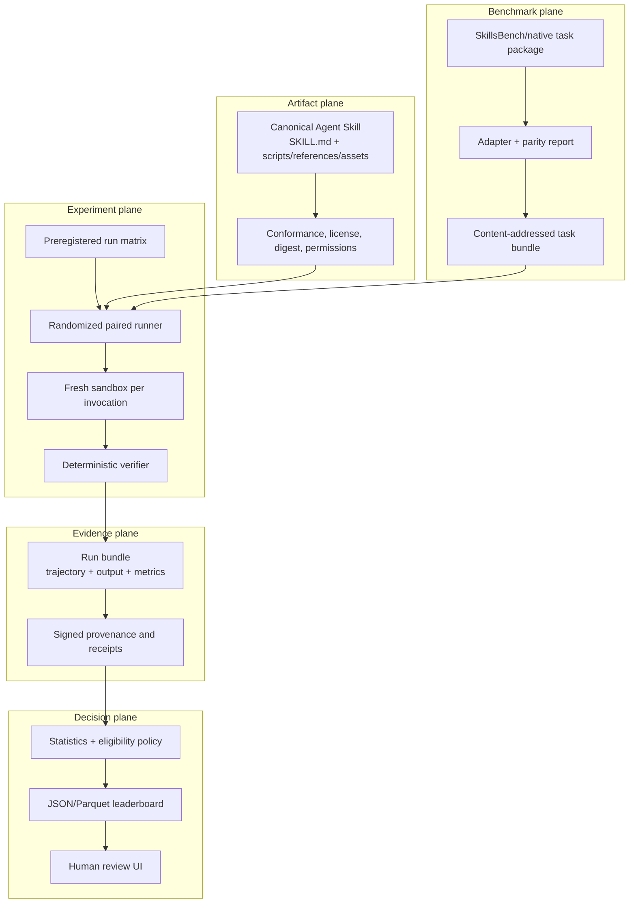

# SKILL.md Arena feasibility study and implementation roadmap

**Review date:** 2026-08-06  
**Target repository:** `ed3c/agent-skills-repo`  
**Primary upstream studied:** `benchflow-ai/skillsbench` and `benchflow-ai/benchflow`  
**Roadmap epic:** [#11](https://github.com/ed3c/agent-skills-repo/issues/11)

## Executive decision

**The repository can become a useful SKILL.md Arena, but it is not an Arena yet.**

Its strongest assets are not the current skill catalog. They are the deterministic anchoring oracle, signed evidence contracts, hard-gate vocabulary, artifact digests, public/blind-pool intent, and explicit separation between mechanical evidence and advisory LLM judgment. Those are unusually good foundations for a qualification service.

The missing product layer is comparative experimentation:

- canonical portable `SKILL.md` artifacts;
- the same task executed with and without each candidate skill;
- multiple agents and pinned execution profiles;
- repeated, randomized, isolated runs;
- uncertainty-aware lift estimates;
- cost, latency, reliability, routing, compatibility, and safety dimensions;
- a machine-verifiable leaderboard and delivery dashboard.

The recommended strategy is **not** to fork SkillsBench and rename it. Use SkillsBench task packages and BenchFlow execution through an adapter and parity gate. Keep this repository focused on the higher-value control plane: artifact admission, experimental design, evidence integrity, statistics, ranking eligibility, and publication.

## 1. What the repository currently is

The repository began as a **skill-asset governance seed**. Its original entrypoint is an ordered local gate runner, with custom skill descriptions, behavior cases, lifecycle datasets, generated documentation, and local verification scripts.

PR #9 added a more substantial qualification core:

- `anchor_oracle/` for deterministic lexical source-anchor verification;
- `skill_arena/core.py` for signatures, evidence schemas, hard gates, lifecycle and economics contracts;
- `skill_arena/skill_assets.py` for canonical artifact digests and public/blind corpus guards;
- `skills/repo_wiki_verified/` as the first native qualification candidate;
- receipt schemas and tests.

PR #10 hardened circular-evidence detection and diagnostic behavior.

This is best described as a **qualification and governance kernel**, not a comparative benchmark product.

## 2. Is it effective today?

### 2.1 What is already effective

| Capability | Evidence | Assessment |
|---|---|---|
| Deterministic lexical source-anchor checks | Native oracle, positive/hollow controls, explicit absence states, circular-evidence hardening | Useful and testable within its declared lexical scope |
| Tamper-evident evidence contracts | SHA-256 bindings, JSON Schemas, Ed25519 verification, profile and policy bindings | Strong foundation; still needs a standard attestation/publication layer |
| LLM-judge authority boundary | Gate results label the judge `advisory_only` | Correct product boundary |
| Artifact and corpus guards | Recomputable artifact digest, public export guard, lexical negative-case conflict check | Valuable admission controls |
| Explicit non-capabilities | The wiki skill states that lexical validity is not semantic truth | Prevents a common overclaim |
| Permissive project license | Repository is MIT licensed | Suitable for commercial reuse |

### 2.2 What is not effective or not yet proven

| Gap | Current evidence | Consequence |
|---|---|---|
| Legacy skill effectiveness | `gemini_interactions/status.json` is `quarantined`, non-routable, with measured delta `0.10` below threshold `0.20`, timeouts, confounded negatives, and shared-working-directory contamination | The original catalog does not provide a production-ready success case |
| First new skill qualification | `repo_wiki_verified/manifest.json` still uses `qualification_receipt_id: pending-qualification` | It is an internally conforming candidate, not an independently qualified skill |
| Portable Agent Skills conformance | Assets use `skills.md`, underscore directory names, and no required YAML frontmatter | SkillsBench and conforming clients cannot consume them as canonical Agent Skills without transformation |
| Executor landing evidence | Issue #3 claims commit `2e5a0c7` landed on `main`, but GitHub cannot resolve that commit in this repository and current `main` does not expose an OpenShell implementation | Tracker state cannot be used as delivery evidence until reconciled |
| End-to-end Arena experiment | No same-case, with-skill/no-skill, randomized, repeated multi-agent runner | No causal skill-lift claim can be made |
| Statistical ranking | No confidence intervals, minimum evidence rule, paired test, heterogeneity report, or multiple-comparison policy | A leaderboard would look precise without being reliable |
| Benchmark breadth | The current public corpus is small and concentrated on the repository/wiki domain | No evidence of broad professional usefulness |
| Repository-wide CI | Workflows are path-specific; third-party Actions use mutable major tags; one workflow installs unpinned `pytest` | Reproducibility and software supply-chain posture are below release-grade expectations |
| Progress consistency | #1, #3 and `openwiki/qualification-pipeline.md` disagree about executor state | Human readers cannot tell what actually exists |

### 2.3 Audit rating

This rating is a decision aid, not a universal score.

| Dimension | Current | Arena MVP target |
|---|---:|---:|
| Deterministic verification | 4/5 | 5/5 |
| Evidence integrity | 3/5 | 5/5 |
| Portable skill conformance | 1/5 | 5/5 |
| Comparative experiment design | 1/5 | 4/5 |
| Statistical validity | 1/5 | 4/5 |
| Benchmark breadth | 1/5 | 3/5 |
| Sandbox evidence on reachable `main` | 0/5 | 4/5 |
| Supply-chain security | 2/5 | 4/5 |
| Delivery/dashboard truthfulness | 2/5 | 5/5 |
| Product differentiation | 3/5 | 5/5 |

**Interpretation:** the repository is ahead of many skill collections in evidence-contract thinking, but behind mature benchmark systems in artifact portability, task breadth, execution, and statistical comparison.

## 3. Product boundary: qualification versus Arena

Do not merge these concepts into one status.

### Qualification

Answers:

> Is this exact skill artifact admissible for this declared host, policy, sandbox, benchmark snapshot, and threshold set?

Output:

- qualified / rejected / quarantined;
- signed receipt;
- exact envelope and expiration;
- deterministic hard-gate evidence;
- human admission where required.

### Arena

Answers:

> Compared with no skill and other candidates, where does this skill improve outcomes, for which agents and task families, with what uncertainty, cost, latency, routing behavior, and regressions?

Output:

- paired lift and confidence interval;
- task-family and agent-profile breakdown;
- eligibility state;
- Pareto/category views;
- replayable evidence bundle;
- no silent lifecycle promotion.

Qualification evidence can flow into Arena admission. Arena rank must not silently modify qualification status.

## 4. Reference architecture



### 4.1 Artifact plane

Use the [Agent Skills specification](https://github.com/agentskills/agentskills/blob/main/docs/specification.mdx) as the external contract:

- required `SKILL.md`;
- YAML frontmatter with `name` and `description`;
- hyphenated canonical names matching the parent directory;
- optional `scripts/`, `references/`, and `assets/`;
- progressive disclosure.

The current private format may remain an authoring source temporarily, but Arena runs must inject a canonical, validated export and bind its digest into every run.

### 4.2 Benchmark plane

Use selected [SkillsBench](https://github.com/benchflow-ai/skillsbench) `task.md` packages. Preserve:

- prompt and taxonomy;
- environment and exact dependency pins;
- oracle and verifier behavior;
- skill injection boundary;
- resource/network policy;
- source commit, path, license, and file digests.

An adapter must emit a parity report. Unsupported semantics fail closed.

### 4.3 Experiment plane

The minimum experiment has a `baseline` arm and one `candidate` arm. Optional placebo and composition arms must be declared separately.

Run identity:

```text
(task_bundle_digest,
 skill_artifact_digest | no-skill,
 agent_id,
 model_id,
 harness_version,
 sandbox_profile,
 policy_digest,
 repetition,
 seed)
```

Required controls:

- preregistered matrix before execution;
- randomized arm order;
- at least three repetitions for MVP;
- fresh sandbox/workspace per invocation;
- pinned agent/model/harness/image/policy;
- no silent retry-until-pass;
- complete failure taxonomy.

### 4.4 Evidence plane

Retain the repository's detailed domain receipts, but expose standard provenance:

- in-toto/SLSA-aligned subject, source and builder identity;
- Sigstore/Cosign or documented offline signing;
- content-addressed skill, task, policy, output, trace and metric artifacts;
- control-plane measurements that user workloads cannot forge;
- independently replayable hash/signature verification.

### 4.5 Decision plane

A candidate first passes eligibility gates, then appears in category-specific views. A single global score hides too much.

Suggested eligibility states:

- `not_ranked_insufficient_evidence`;
- `not_ranked_incompatible`;
- `ineligible_safety_regression`;
- `ineligible_critical_regression`;
- `eligible_no_significant_lift`;
- `eligible_positive_lift`.

## 5. Experimental and statistical policy

### 5.1 Primary effect

For case/profile unit `i`:

```text
d_i = outcome(candidate_i) - outcome(baseline_i)
paired_lift = mean(d_i)
```

The pairing is load-bearing. Do not compare unrelated aggregate runs.

### 5.2 Binary outcomes

Publish:

- baseline and candidate pass counts;
- discordant pair counts;
- absolute paired lift;
- exact McNemar test;
- confidence interval for the paired effect.

### 5.3 Graded outcomes

Use a paired bootstrap over task/profile units. Repetitions stay clustered within their task/profile; they are not independent benchmark tasks.

### 5.4 Heterogeneity

Always expose:

- task-family lift;
- agent/model-profile lift;
- critical-case regressions;
- repetition variance;
- incompatibility and missing-run counts.

A pooled average must not be presented as universal performance.

### 5.5 Multiple candidates

Freeze a multiple-comparison policy before the ranking run. Publish the unadjusted estimates as well as the eligibility decision. Optional Bayesian hierarchical estimates may improve shrinkage, but raw paired counts and frequentist intervals remain visible.

### 5.6 Metrics beyond task reward

| Dimension | Metrics |
|---|---|
| Quality | pass rate, graded reward, paired lift, critical regressions |
| Routing | activation precision/recall, false positive/negative activation |
| Efficiency | latency, token usage, tool calls, estimated cost under versioned pricing |
| Reliability | timeouts, infra/transport/verifier/task failures, run-to-run variance |
| Safety | permission, network, filesystem and policy violations |
| Portability | supported agent/host/profile rate |

LLM-judge outputs are evidence with judge/model/prompt identity. They never override deterministic failures.

## 6. Build-versus-adopt decisions

All listed candidates are permissively licensed or standards/specifications suitable for commercial use. Exact versions and license files still need to be pinned and verified at adoption time.

| Need | Adopt/evaluate | License | Decision |
|---|---|---|---|
| Portable skill format | [Agent Skills + skills-ref](https://github.com/agentskills/agentskills) | Apache-2.0 | Adopt as external contract |
| Professional task corpus | [SkillsBench](https://github.com/benchflow-ai/skillsbench) | Apache-2.0 | Consume selected tasks through parity adapter |
| Multi-agent execution | [BenchFlow](https://github.com/benchflow-ai/benchflow) | Apache-2.0 | Initial runner adapter; keep evidence schema harness-independent |
| Traces/metrics/logs | [OpenTelemetry](https://opentelemetry.io/) | Apache-2.0 | Adopt semantic conventions where practical |
| Experiment operations UI | [MLflow](https://mlflow.org/) | Apache-2.0 | Optional operator UI; not evidence authority |
| Local analytics | [DuckDB](https://duckdb.org/) + Parquet | MIT / Apache-2.0 ecosystem | Adopt for leaderboard materialization and local queries |
| Policy as code | [Open Policy Agent](https://www.openpolicyagent.org/) | Apache-2.0 | Evaluate for admission/publication/sandbox policies |
| Signing and attestations | [Sigstore/Cosign](https://docs.sigstore.dev/) + in-toto/SLSA | Apache-2.0 ecosystem/spec | Adopt standard publication envelope around detailed receipts |
| Container isolation | [gVisor](https://gvisor.dev/) | Apache-2.0 | Preferred stronger-than-Docker profile to evaluate |
| MicroVM isolation | [Firecracker](https://github.com/firecracker-microvm/firecracker) | Apache-2.0 | Evaluate when multi-tenant/untrusted code requires VM boundary |
| OSS posture | [OpenSSF Scorecard](https://scorecard.dev/) + [OSV](https://osv.dev/) | Apache-2.0 ecosystem | Add as gates/signals; aggregate score is not a guarantee |

### Do not adopt blindly

- Do not make MLflow or any hosted UI the evidence source of truth.
- Do not depend on BenchFlow private internals; invoke a pinned public CLI/API through an adapter.
- Do not treat container isolation as equivalent to a VM threat model.
- Do not allow a library's permissive license to substitute for dependency, vulnerability, or data-license review.
- Do not introduce AGPL, SSPL, Commons Clause, or similar obligations without an explicit product/legal exception.

## 7. Standards expected from a large technology organization

### 7.1 Reliability: SLOs with consequences

Google SRE's error-budget model treats reliability targets as decision controls, not decorative metrics. Apply the same idea to the Arena:

- define replay success, verifier determinism, infrastructure failure and publication freshness SLOs;
- stop ranking publication when the error budget is exhausted;
- separate product failures from infrastructure failures;
- require a postmortem/action item for material evidence or ranking incidents.

References:

- [Google SRE error budget policy](https://sre.google/workbook/error-budget-policy/)
- [Google SRE service best practices](https://sre.google/sre-book/service-best-practices/)

### 7.2 Supply chain: provenance and non-forgeability

Use current SLSA provenance concepts:

- artifact subject digest;
- source and build instructions;
- builder identity;
- authenticated provenance;
- isolation between runs;
- user workload cannot inject trusted control-plane fields.

Reference: [SLSA specification](https://slsa.dev/spec/).

### 7.3 Observability: traces, metrics, logs

OpenTelemetry-compatible evidence makes agent steps, resource measurements and failures inspectable without binding the product to one vendor UI.

Reference: [OpenTelemetry signals](https://opentelemetry.io/docs/concepts/signals/).

### 7.4 Security: policy as code and least privilege

- no-network default;
- explicit read/write mounts;
- explicit allowed tools and secrets policy;
- fresh ephemeral workspace;
- pinned sandbox profile and image digest;
- fail closed on missing policy/evidence;
- signed publication bundle.

### 7.5 Release engineering: immutable inputs and canary publication

- pin upstream commits and dependencies;
- version every task, skill, policy and sandbox profile;
- publish candidate leaderboard snapshots before promoting `latest`;
- verify replay and schema compatibility against a small canary set;
- roll back the pointer, never mutate an old snapshot.

## 8. MVP

The smallest Arena that can produce a meaningful decision:

- two competing, spec-conformant skills plus no-skill baseline;
- eight professional tasks across at least two task families;
- two pinned agent/model profiles;
- three paired repetitions per arm;
- deterministic verifier for every scored requirement;
- public calibration and sealed qualification snapshots;
- paired lift with 95% interval and failure counts;
- latency, token/cost, routing, reliability and safety dimensions;
- signed JSON result bundle;
- Parquet leaderboard snapshot queryable with DuckDB;
- static review page with drill-down;
- evidence-backed GitHub delivery dashboard.

Approximate run count before retries or oracles:

```text
8 tasks × 2 profiles × 3 arms (2 skills + baseline) × 3 repetitions = 144 runs
```

This is large enough to expose variance and cross-agent incompatibility, but small enough for an MVP.

## 9. Roadmap

| Order | Issue | Outcome |
|---:|---|---|
| 1 | [#12](https://github.com/ed3c/agent-skills-repo/issues/12) | Reconcile executor claim and make landing evidence machine-verifiable |
| 1 | [#13](https://github.com/ed3c/agent-skills-repo/issues/13) | Canonical `SKILL.md` export and upstream conformance validation |
| 2 | [#14](https://github.com/ed3c/agent-skills-repo/issues/14) | SkillsBench task adapter with executable parity report |
| 3 | [#15](https://github.com/ed3c/agent-skills-repo/issues/15) | Paired randomized repeated runner and signed run bundle |
| 3 | [#16](https://github.com/ed3c/agent-skills-repo/issues/16) | Public/sealed corpus lifecycle and leakage controls |
| 4 | [#17](https://github.com/ed3c/agent-skills-repo/issues/17) | Statistical eligibility and multi-dimensional ranking |
| 4 | [#18](https://github.com/ed3c/agent-skills-repo/issues/18) | License, SBOM, provenance, CI and sandbox trust gates |
| 5 | [#19](https://github.com/ed3c/agent-skills-repo/issues/19) | JSON/Parquet leaderboard and Projects v2 automation |

Phase 0 issues #12 and #13 can proceed in parallel. All other work should preserve their blockers rather than simulating progress around them.

## 10. High-value product directions after MVP

### 10.1 Skill CI for authors

A pull request reports:

- conformance;
- with/without-skill lift;
- regressions by task family and agent;
- token/cost and latency change;
- routing false positives;
- evidence bundle.

This is the clearest early user value and can exist before a public marketplace.

### 10.2 Enterprise skill procurement

Teams can select skills by compatible host/profile, verified task families, risk envelope, license and evidence freshness instead of stars or marketing claims.

### 10.3 Runtime skill routing

The Arena supplies a routing policy with calibrated activation precision/recall and fallback skills. Runtime feedback can suggest new evaluation cases, but must not rewrite sealed benchmark results.

### 10.4 Compliance-grade internal registry

Signed qualifications, revocation, expiration, SBOM, provenance and audit trails make skills governable in regulated environments.

### 10.5 Skill optimization loop

Use failure clusters and traces to propose skill changes, then evaluate them as new immutable candidates. Never optimize directly on the sealed qualification set.

## 11. Kill criteria and decision checkpoints

Pause or narrow the product if any of these persist after MVP calibration:

- replay verification cannot reproduce published digests;
- infrastructure failures consume enough runs to dominate measured lift;
- no task family shows a stable positive lift over no-skill baseline;
- routing false positives erase quality gains;
- qualification cost is greater than plausible user willingness to pay;
- benchmark leakage cannot be controlled;
- imported task parity cannot be demonstrated;
- the product requires a universal score to appear useful.

A failed broad Arena can still produce a valuable narrower product: source-verified documentation skill qualification and CI.

## 12. Immediate next actions

1. Resolve #12 before relying on any existing completion claim.
2. Implement #13 as the first code slice; portability unlocks upstream tooling and comparative runs.
3. Import three SkillsBench tasks through #14 and prove verifier parity.
4. Run a small public calibration matrix before building the public leaderboard UI.
5. Freeze statistical and publication policies before any result is called a rank.

The machine-readable projection of this roadmap lives at `data/project/skill-arena-roadmap.json`; `scripts/check_skill_arena_roadmap.py` validates its schema, dependencies and status invariants.